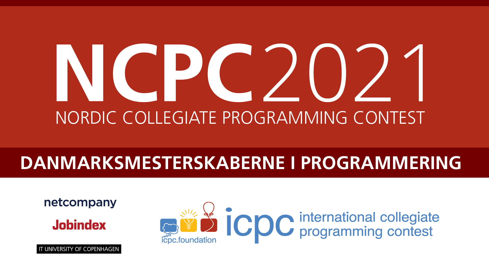

# Nordic Collegiate Programming Championships 2021 at ITU

<!--  -->

ITU will be a local hub for the 2021 edition of NCPC, the Nordic Collegiate Programming Championships.
Part of which are the Danish programming championships (“Danmarksmesterskaberne i programmering”).

NCPC@ITU 2021 will take place on 

* Saturday, 9 October 2021, 10:00–17:00 on the 2nd floor, Rued Langgaards Vej 7.

You need to [Register at ICPC](https://icpc.global/regionals/finder/Nordic-2021) to participate.
Registration is not open yet.

Program (preliminary):

* 10:00 Doors are open, teams can arrive, get seated, and hook up their computers
* 10:45 Introduction and welcome. (Aud 3) 
* 11:00 Contest opens. (Link will be here, probably [ncpc21.kattis.com](https://ncpc21.kattis.com).)
* 16:00 Contest closes.
* 16:05–17:00 Scoreboard reveal, solution presentation. (Aud 3)

## Preparation

1. Find a team, preferably of fellow students that you already interact with. Your study group would be perfect; you can be at most 3. Come up with a clever team name.
2. Train by solving previous NCPC problems in your team. See [NCPC site](https://nordic.icpc.io). 
   As you can see, if you manage to solve just 1 problem, you are in very select company.

